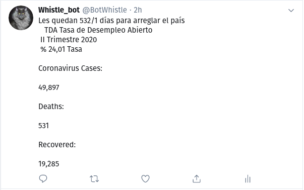
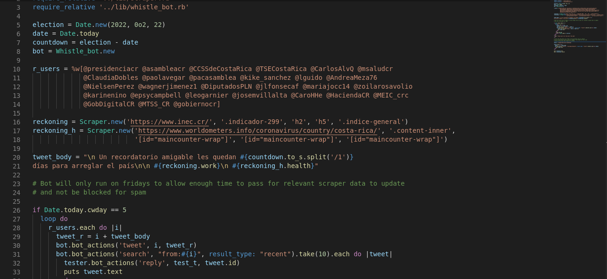
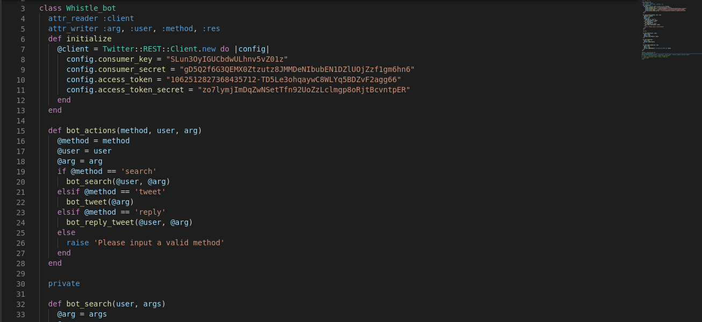
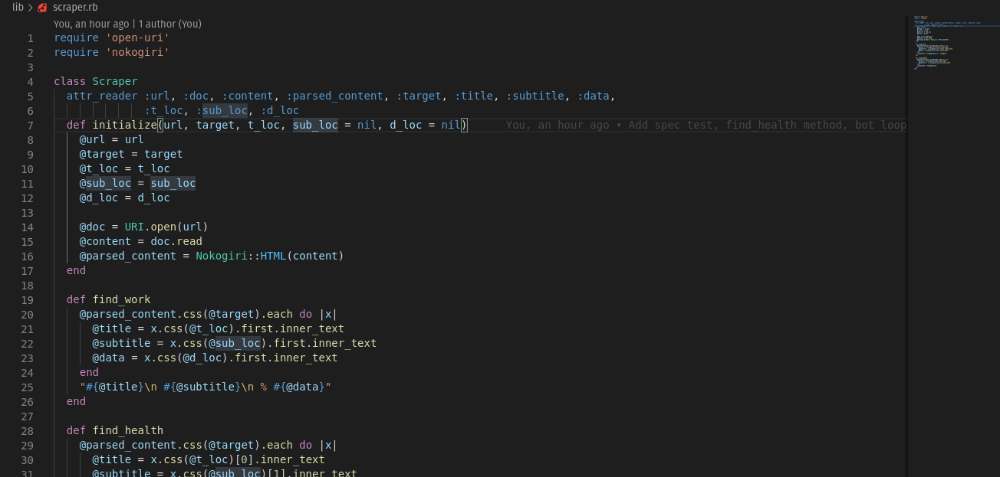

# Ruby-Capstone-Twitter-Bot

In this repo a twitter bot was built using Ruby and Twitter Gem:

- Created bot class
- Define bot initialize methods to connect with twitter API
- Define bot_actions method to access private methods
- Define private bot methods tweet, search & reply
- Built web scraper for bot content using nokogiri
- Create scraper class
- Define scraper methods
- Create background tweet loop in main that tweet's every friday 

## Setup

- Download or clone the repository's files [github repo](https://github.com/jurgen1cRuby-Capstone-Twitter-Bot.git)
- Have Ruby 2.7 installed (to check if it is installed you can run: ruby -version in your console)
- Install necessary gems from Gemfile(Chatterbot & Nokogiri, run cmd gem install <'gem name'>)
- In your terminal navigate to directory and run command ruby bin/main.rb
- For tests, in your terminal, run cmd rspec (be sure to be in project directory)

## Description

- The purpose of this bot is to apply some social pressure to the current government cabinet of my country (Costa Rica), by reminding each of them how many days they have left to enact change until the next election. This pressure is backed up with data from the national census ministry on unemployment and the current data on covid cases from worldometers.info. The bot will only run on Friday to allow enough time between tweets for scraper data to have changed, if an attempt is made to run it on a different day of the week the bot will ask you to please wait until next friday.

  

## Video Presentation
 [Video Presentation](https://www.loom.com/share/647026b2c1ca4ef5977bd717f9af2baa)

## Main Screenshot

## Bot Screenshot

## Scraper Screenshot

## Built With

- Code editor: VsCode
- Language: Ruby
- Linters: Rubocop, Rspec

### Prerequisites

- Vscode or code editor of choice
- Ruby language
- Browser (Google Chrome, Mozilla Firefox, Safari or any other browser)

## Author

👤 **Jurgen Clausen Gutierrez**

- Github: [@jurgen1c](https://github.com/jurgen1c)
- LinkedIn: [jurgen-clausen](https://www.linkedin.com/in/jurgen-clausen-2740061a9/)

## 🤝 Contributing

Contributions, issues and feature requests are welcome!

Feel free to check the [issues page](https://github.com/happiguru/Enumerable_methods).

## Show your support

Give a ⭐️ if you like this project!

## Acknowledgments

- Microverse
- GitHub
- Ruby

## 📝 License

This project is [MIT](lic.url) licensed.

